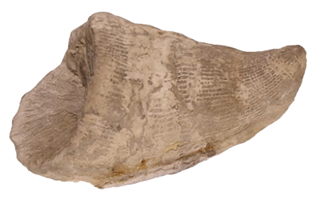
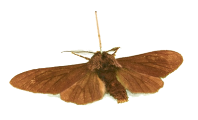

## Here and Now: Objects and Datasets

The **here and now** digital artwork combines artefacts from the Great North Museum: Hancock and elsewhere, with datasets about our environment to tell stories of how we are changing our world and our world is changing us.

The artwork currently features the following objects and datasets:

A **lump of coal** and data showing [annual UK coal production from 1853 to 2017](https://www.gov.uk/government/statistical-data-sets/historical-coal-data-coal-production-availability-and-consumption).

The collapse of coal mining in the North East had massive effects on jobs and local communities. As we move towards a low carbon future, we need to make sure that jobs make this transition as well.

A **ram’s horn coral** and data showing [global CO2 levels from 1800 to 2017](https://www.co2.earth/historical-co2-datasets).

Concentrations of CO2 in the atmosphere have risen from 277 (mole fraction of CO2) to over 400 between zero AD and 2018. This is the highest level for about 3.5 million years.

A **bicycle derailleur and chain** and data showing [car ownership in North East England from 1994 to 2017](https://www.gov.uk/government/statistical-data-sets/veh02-licensed-cars).

The modern bicycle with chain and gears led to tarmac roads and cheap, independent travel for many – in Victorian times including women previously reliant on their husbands to travel. But we still use cars for many small journeys and most cyclists are men.

An **Iniut carved walrus tusk** and data showing [minimum Artic sea ice extent from 1979 to 2017](https://sites.google.com/site/arcticseaicegraphs/longterm).

Environmental change is reducing the amount of snow and ice in artic areas. This is threatening the Inuit nomadic way of life as the habitats of the animals they hunt disappear.

The **peppered moth** and data showing [UK emissions of CO2 from burning coal from 1960 to 2016](http://www.globalcarbonatlas.org/en/CO2-emissions).

The peppered moth is usually a pale colour with brown spots and swirls, but sometimes darker moths are found that are almost entirely brown. During the industrial revolution, when smoke from burning coal was much higher, the darker form of the moth thrived as it could better hide on soot-covered trees than the paler-spotted form. As emissions are reducing, the paler-spotted form is now thriving.

A **permian fish fossil** and data showing [increases in sea surface temperatures from 1880 to 2010](https://www.epa.gov/climate-indicators/climate-change-indicators-sea-surface-temperature).

The platysomus lived in the shallow, tropical Zechstein Sea in NE England 250 million years ago during the Permian period. Back then, Newcastle was closer to the equator than it is today.

A **roman lead pipe** and [global population data](https://esa.un.org/Unpd/wpp/Publications/Files/Key_Findings_WPP_2015.pdf).

The section of lead pipe was used to bring water into the Roman town of Corbridge. Around 60 million people lived in the Roman Empire, roughly the population of the UK today. Evidence of the pollution caused by Roman industrial activity, like the metal working which made this pipe, can be detected in ice cores taken from the Arctic.

An **auroch skull** and data showing [global agricultural land-use](https://ourworldindata.org/yields-and-land-use-in-agriculture).

The Auroch was a wild ancestor of today’s domestic cattle, which lived in Northumberland 10,000 years ago but is now extinct. Retreating ice sheets left a cold landscape of forests, lakes and rivers, habitat for the great herds of Auroch. As the climate warmed, hunter gatherers moved into the area and the Auroch faced pressure from hunting. As communities became more settled and started farming, they domesticated the Auroch, breeding out the powerful and aggressive traits of the wild animal to create the more docile animal we know as the domestic cow. The Auroch became globally extinct several centuries ago, but could have survived with less pressure from humans. 

**Air-freighted broccoli** from Kenya and [the amount of food imported by air into the UK from 1996 to 2017](https://www.uktradeinfo.com/Statistics/).

Rising amounts of ‘out of season’ fruit and vegetables are flown into the UK from outside, to meet the desire of shops and consumers for food when it is out of season in the UK, or which cannot be grown here. 

Between 1996 and 2017, the amount of food from outside the EU flown into UK airports rose from 132 thousand tonnes to 2 million tonnes. 

