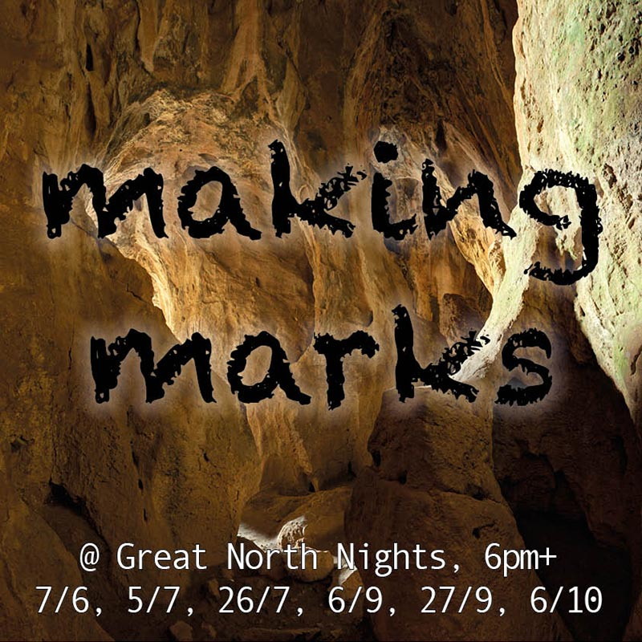

# here and now change .net
Interactive, immersive, digital artworks for public conversations on climate change.

## In 2019:

“Our world has always changed. Inside caves like this one at Whitburn on the North East coast, we find the marks of how the world used to be. Once, Whitburn lay at the bottom of a shallow sea. Tropical fish and plants lived and died here for millions of years, leaving their imprints in the seabed. Much later, the sea dried up and ice ages came. People moved into the new land, carving deerhorn into harpoons for hunting. As the world thawed, melting ice flooded the land and people and animals fled. Seabirds like the Great Auk lost their sources of food, unable to adapt to a new world. Today, we are changing our world, but much faster and in many different ways. The caves at Whitburn were quarried away a century ago. We have a choice now, of how we leave our mark on our world…”

**making marks** is a digital artwork that presents visual and sonic marks of a changing world. Some of these marks are objects you can find in the Great North Museum: Hancock’s collection, including fish and plant fossils, animal bones from the Whitburn sea caves, taxidermy of the Great Auk, and the Whitburn harpoon. **making marks** asks you to continue the story that these marks begin of a climate-changed World, through drawing your own mark which then becomes part of the growing artwork.

**making marks** is a collaboration between [Martin O’Leary](https://www.patreon.com/mewo2), [Simon Bowen](http://www.simon-bowen.com/), and [David de la Haye](http://daviddelahaye.co.uk/) with contributions from [@SarahLMander](https://twitter.com/SarahLMander), [@AlistairCFord](https://twitter.com/AlistairCFord), [@jocwhit](https://twitter.com/JoCWhit) and artwork visitors. 

**making marks** is supported by the [Great North Museum: Hancock](https://greatnorthmuseum.org.uk/), [Open Lab](https://openlab.ncl.ac.uk/) and the [Tyndall Centre for Climate Change Research](http://www.tyndall.ac.uk/).

## In 2018:
[here and now](hereandnow.html)